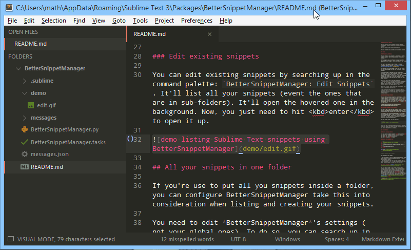

# Better Snippet Manager

You can list all your snippets (even in infinite sub-folders, they're listed in one panel, for quick access)
You can create some snippet interactively.

The two commands are available in the command palette.

## Usage

### Create new snippets

You can create a new snippet by selecting up in the command palette `BetterSnippetManager: Create New Snippet`.

It's going to ask you different *snippet specific* questions: the `trigger`, the `description`, the `scope`.

If you're not aware of any of them, I strongly recommend having a look at [the community powered unofficial documentation][snippets-doc]

In addition, it's also going to ask you the `folder` to save this snippet in, and the `file name` of you snippet.

The folder name is defined with the scope you're currently in. So, if you're writing `JSON`, it's going to propose you to save this in a `json` folder (because the scope is `source.json`). You can of course change this (note that if you put nothing in, it's going to put it at the root of your folder (in this case `User`)).

The `filename` has to have the extension `.sublime-snippet` to be taken into account by Sublime Text. So, it's added by default. The name alone is defined by the trigger you chose earlier in the process, but you can change this as well.

Once this is done, it'll create the snippet file, and open it in Sublime Text for you.



*The content of the snippet is the content of your selection when you created ran `BetterSnippetManager: Create New Snippet` (it can be empty, it's just a little trick)*

### Edit existing snippets

You can edit existing snippets by searching up in the command palette: `BetterSnippetManager: Edit Snippets`. It'll list all your snippets (event the ones that are in sub-folders). It'll open the hovered one in the background. Now, you just need to hit <kbd>enter</kbd> to open it up.


## All your snippets in one folder

If you're used to putting all your snippets inside a folder, you can configure BetterSnippetManager take this into consideration when listing and creating your snippets.

You need to edit *BetterSnippetManager*'s settings (not your global ones). To do so, you can search up in the command palette `Preferences: BetterSnippetManager Settings`, or use the menus `Preferences → Packages Settings → BetterSnippetManager`.

In the *right* file, you can add this:

```json
"snippets_folder": "my_snippet_folder"
```

and, like this, BetterSnippetManager will go straight into this folder (so don't list the snippet outside of it, which shouldn't be a problem).

## [SaneSnippet][] is supported!

The commands stay *exactly* the same, all you have to do is set this plugin setting `use_sane_snippet` to `true`!

*Note: of course, you have to install [SaneSnippet][]*

Here's what a Sane Snippet looks like:

```
---
description: nice print for debug
tabTrigger:  print
scope:       source.python
---
print("$TM_FILENAME:$TM_LINE_NUMBER", $1)
```

Awesome, right?

## Installation

### Using package control

1. Open up the command palette: <kbd>ctrl+shift+p</kbd>
2. Search for `Package Control: Install Package`
3. Search for `BetterSnippetManager`
4. Hit <kbd>enter</kbd> :wink:

### Using the command line

```bash
cd "%APPDATA%\Sublime Text 3\Packages"             # on window
cd ~/Library/Application\ Support/Sublime\ Text\ 3 # on mac
cd ~/.config/sublime-text-3                        # on linux

git clone "https://github.com/math2001/BetterSnippetManager"
```

> Which solution do I choose?

It depends on of your needs:

- If you intend to just use BetterSnippetManager, then pick the first solution (Package Control), **you'll get automatic update**.
- On the opposite side, if you want to tweak it, or even contribute (:+1:), use the second solution. Note that, to get updates, you'll have to `git pull`

## How to open the [`README`](https://github.com/math2001/FileManager/blob/master/README.md)

To open their README, some of the packages add a command in the menus, others in the command palette, or other nowhere. None of those options are really good, especially the last one on ST3 because the packages are compressed. But, fortunately, there is a plugin that exists and will **solve this problem for us** (and he has a really cute name, don't you think?): [ReadmePlease](https://packagecontrol.io/packages/ReadmePlease). :tada:

[snippets-doc]: http://docs.sublimetext.info/en/latest/extensibility/snippets.html

## Note

In every screenshot, I was using the [Boxy Theme](https://packagecontrol.io/packages/Boxy%20Theme) (Monokai), with the corresponding color scheme. The font was *Droid Sans Mono*.

[SaneSnippet]: https://packagecontrol.io/packages/SaneSnippets
